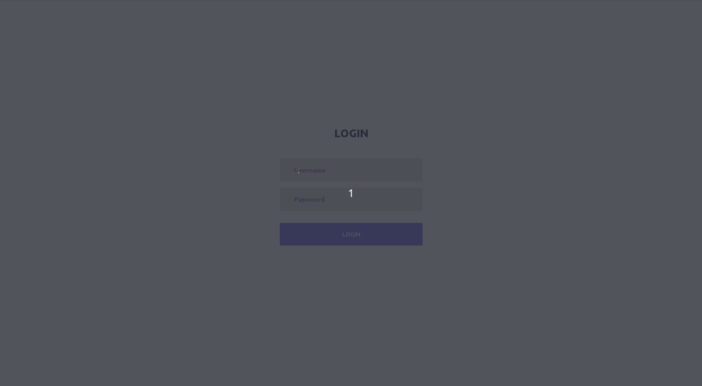

  

<h3 align="center">Boiler (or any other electrical device) Remote Control</h3>

---

 Using Omega Onion Development Board
      

## 📝 Table of Contents

- [About](#about)
- [Getting Started](#getting_started)
- [Connecting The Hardware](#hardware)
- [Built Using](#built_using)
- [TODO](../TODO.md)
- [Contributing](../CONTRIBUTING.md)
- [Authors](#authors)
- [Acknowledgments](#acknowledgement)

## 🧐 About 

A small home project to turn the boiler on or off remotely (Web or Google Assistant).   
I could buy a Switcher (https://switcher.co.il/) but it will be too easy...   
Disclaimer - I am not a from-end or back-end developer, it is only a hoby of mine :-)   
Any improvement suggestions are welcome

## 🏁 Getting Started 

These instructions will get you a copy of the project up and running on your local machine for development and testing purposes. See folder specific README files for specific notes.

### Prerequisites

Things you will need:
- Omega Onion Development board - 
(https://onion.io/store/omega2p/) 
- Omega Expansion Dock (https://onion.io/store/expansion-dock/) 
- Optional - Ethernet expansion board - (https://onion.io/store/ethernet-expansion/)  
- AC Contactor, DIN Rail (https://tinyurl.com/ydgv6fjs)  
- 5V Relay, DIN Rail (https://tinyurl.com/ycmy6pxu)  
- WEB SERVER ( I am using APACHE in this exmaple )

### Basic Overview
1. Omega board will send an heartbeat every X seconds (8sec in this example).  
2. Right after sending the heartbeat, Omega board will check if an action ( On or Off ) is made.  
3. If an ON action has been detected, Omega board will set its GPIO to the requested status and the boiler will turned on.  
4. If no OFF action has been detected for 45 minutes (configurable) the Omega board will unset its GPIO to turn off the boiler.  
5. In case no heatbeat is recieved by the server, the user will see a message that the system is not ready and the button wil not be clickable.  
6. NOTE: after every operation ( ON or OFF ), Omega will send a Telegram message to the configured group (Chat ID).
<INSER SKETCH>  
7. Integrated with Google Assistance using IFTT (https://ifttt.com)  
8. After a succefull login, the web server will set a session cookie so you will not need to authenticate again. (You can disable it of course)  

## 🔧 Connecting The Hardware 

Will update soon  
DISCLAIMER: Any changes in your electric distribution board is really dangerous !!! do it only of you know what you are doing. Use at your own risk.

## ⛏️ Built Using 

- [Mysql](https://www.mysql.com/) - Database
- [PHP](https://www.php.net/) - Server Scripting Language
- [Python](https://www.python.org/) - General-Purpose Programming Language
- [Omega](https://onion.io/omega2/) - Development Board  
- [LetsEncrypt](https://letsencrypt.org/) - Free TLS certificate

## ✍️ Authors 

- [@tzakhima](https://github.com/Tzakhima/) - Idea & Initial work

## 🎉 Acknowledgements 

- [RApidAPI Blog](https://rapidapi.com/blog/) - How to Build a RESTful API in PHP 
- [Free Frontend](https://codepen.io/AlexJedi/pen/rwwvXw) - Toggle Switch Design
